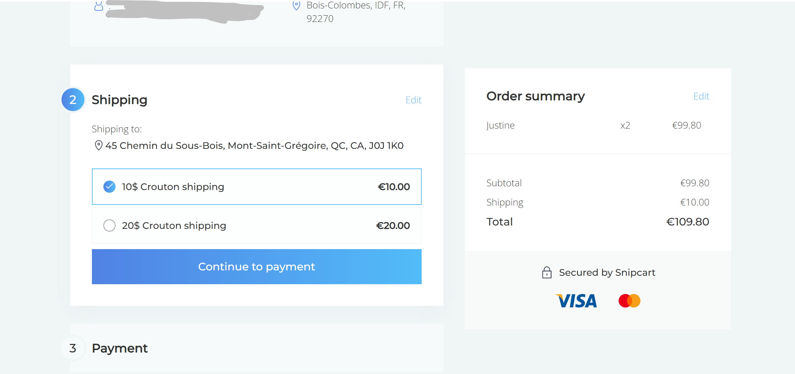

# High Level Architecture 
<!-- Schematiscs go here -->

# Goshippo Snipcart Adapter

## The idea (specs)

### High level Scenario 


* `Snipcart` will first query adapter using a webhook, to get shipment rates (and add the shipment costs to the bill)
* Adapter will, after payment is complete, trigger the `goshippo` shipment, and it should end by making a notification on a chatops like `discord` ("create shipment" endpoint)
* anyway, the adapter will : 
  * receive the snipcart webhook request to get shippo rates (and answer to the webhook) 
  * query goshippo api to create the shipment (id say using a webhook...?)
  * send the discord message via a hubot discord chatbot 
  * all of actions must be persisted by the discord chatbot


_Persistence of all workflow executions history_


### Technical implementation

<!-- Maybe `n8n` would be nice as a second design. multi-tenancy and `n8n` ? -->


<!-- 
https://formspree.io 's documentation proposes to use its webhooks by running an enpoint on https://runkit.io : 

https://help.formspree.io/hc/en-us/articles/360015234873-Webhooks
-->

I can use Runkit this to integrate via webhooks Snipcart and Goshippo

Indeed, [this snipcart docs page](https://docs.snipcart.com/v3/setup/shipping#webhooks) shows that the snipcart process can be integrated with Goshippo using a Snipcart webhook.


To implement the design, i used The runKit NoteBook which is accessible iun browser via URL : https://runkit.com/ctrtechlead/62cf1a47ebc2880009354ee7

### The snipcart webhook 

* snipcart sends a webhooks HTTP POST request, and expects a `2XX` HTTP response code as a success, containing a JSON payload ( `HTTP` Method `POST` `Content-Type application/json` ) :

```JSon
{
  "eventName": "shippingrates.fetch",
  "mode": "Live",
  "createdOn": "2015-02-21T14:58:02.6738454Z",
  "content": {
    "token": "22808196-0eff-4a6e-b136-3e4d628b3cf5",
    "creationDate": "2015-02-21T14:58:02.6738454Z",
    "modificationDate": "2015-02-21T14:58:02.6738454Z",
    "status": "Processed",
    "currency": "USD",
    "lang": "en",
    "paymentMethod": "CreditCard",
    "email": "customer@snipcart.com",
    "cardHolderName": "Nicolas Cage",
    "billingAddressName": "Nicolas Cage",
    "billingAddressCompanyName": "Company name",
    "billingAddressAddress1": "888 The street",
    "billingAddressAddress2": "",
    "billingAddressCity": "Québec",
    "billingAddressCountry": "CA",
    "billingAddressProvince": "QC",
    "billingAddressPostalCode": "G1G 1G1",
    "billingAddressPhone": "(888) 888-8888",
    "shippingAddressName": "Nicolas Cage",
    "shippingAddressCompanyName": "Company name",
    "shippingAddressAddress1": "888 The street",
    "shippingAddressAddress2": "",
    "shippingAddressCity": "Québec",
    "shippingAddressCountry": "CA",
    "shippingAddressProvince": "QC",
    "shippingAddressPostalCode": "G1G 1G1",
    "shippingAddressPhone": "(888) 888-8888",
    "shippingAddressSameAsBilling": true,
    "finalGrandTotal": 310.00,
    "shippingAddressComplete": true,
    "creditCardLast4Digits": "4242",
    "shippingFees": 10.00,
    "shippingMethod": "Livraison",
    "items": [{
      "uniqueId": "eb4c9dae-e725-4dad-b7ae-a5e48097c831",
      "token": "22808196-0eff-4a6e-b136-3e4d628b3cf5",
      "id": "1",
      "name": "Movie",
      "price": 300.00,
      "originalPrice": 300.00,
      "quantity": 1,
      "url": "https://snipcart.com",
      "weight": 10.00,
      "description": "Something",
      "image": "http://placecage.com/50/50",
      "customFieldsJson": "[]",
      "stackable": true,
      "maxQuantity": null,
      "totalPrice": 300.0000,
      "totalWeight": 10.00,
      "shippable": true,
    }],
    "subtotal": 610.0000,
    "totalWeight": 20.00,
    "discounts": [],
    "willBePaidLater": false
  }
}
``` 
* the reponse must provide snipcart with the shipping rates to propose to snipcart (snipcart requires one HTTP response Header, namely `Content-Type:	application/json`) : 

```JSon
{
  "rates": [{
    "cost": 10,
    "description": "10$ shipping"
    }, {
    "cost": 20,
    "description": "20$ shipping",
    "guaranteedDaysToDelivery": 5
    },
    ...
  ]
}
```


### The Goshippo Endpoints 

To query all goshippo api endpointds, i'll use the offical `nodejs` goshippo client https://github.com/goshippo/shippo-node-client


### The runkit implementation

I will use [a Runkit Endpoint](https://runkit.com/docs/endpoint)

<!-- 
* A first basic implementation would give : 

```JavaScript
/**
 * - [request]  An instance of node's [http.IncomingMessage](https://nodejs.org/docs/v0.10.40/api/http.html#http_http_incomingmessage), with full access to its properties and methods.
 * - [response]  An instance of node's [http.ServerResponse](https://nodejs.org/docs/v0.10.40/api/http.html#http_class_http_serverresponse), also with full access to its properties and methods. 
 **/


exports.POKUS_RUNKIT_MOUNT_PATH = process.env.RUNKIT_MOUNT_PATH
exports.POKUS_RUNKIT_ENDPOINT_URL = process.env.RUNKIT_ENDPOINT_URL

exports.endpoint = function(request, response) {
    // your code goes here
    console.info(` valeur de POKUS_RUNKIT_MOUNT_PATH = [${exports.POKUS_RUNKIT_MOUNT_PATH}] `)
    console.info(` valeur de POKUS_RUNKIT_ENDPOINT_URL = [${exports.POKUS_RUNKIT_ENDPOINT_URL}] `)
    let pokusResponse = ` valeur de POKUS_RUNKIT_MOUNT_PATH = [${process.env.RUNKIT_MOUNT_PATH}] `
    pokusResponse += `|| valeur de POKUS_RUNKIT_ENDPOINT_URL = [${process.env.RUNKIT_ENDPOINT_URL}] `
    let pokusJSonResponse = {
        runkit_mount_path: {
            runkit_env: `RUNKIT_MOUNT_PATH`,
            value: `${exports.POKUS_RUNKIT_MOUNT_PATH}`
        },
        runkit_endpoint_url: {
            runkit_env: `RUNKIT_ENDPOINT_URL`,
            value: `${exports.RUNKIT_ENDPOINT_URL}`
        }
    }

    let pokusToSnipcartJSonResponse = {
        "rates": [{
            "cost": 10,
            "description": "10$ croutenard shipping"
            }, {
            "cost": 20,
            "description": "20$ croutenard shipping",
            "guaranteedDaysToDelivery": 5
            }
        ]
    }
    
    response.setHeader(`Content-Type`,`application/json`)

    response.write(JSON.stringify(pokusToSnipcartJSonResponse))
    response.end()

}


```
 -->

Implementation, using `express` : 

* getting Http Request query parameters, getting Http Request JSON payload, answering with JSON :

```JavaScript

var express = require("@runkit/runkit/express-endpoint/1.0.0");
const shell = require("shelljs");
const { query, validationResult } = require("express-validator");
const cors = require("cors");
const request = require("request");
var bodyParser = require('body-parser');

const app = express(exports);
// app.use(bodyParser.urlencoded({ extended: false }));
app.use(bodyParser.json()); /// this one is fine
// app.use(express.bodyParser()); /// this one throws a Runkit Endpoint Init Exception
// parse application/x-www-form-urlencoded
app.use(bodyParser.urlencoded({ extended: false }));
// parse application/json
app.use(bodyParser.json())
// // parse application/vnd.api+json as json
// app.use(bodyParser.json({ type: 'application/vnd.api+json' }));
// parse application/json as json
app.use(bodyParser.json({ type: 'application/json' }));
// app.use(cors());


/**
 * There you can check content of package.json : express is not declared in there, npm installations are made without --save option by runkit
 */
const catPackageJson = () => {
    // Run external tool synchronously
    let shellCmd = {};
    let shellCmdStdout = {};
    let shellCmdStderr = {};
    const POKUS_RAW_CHECK_CMD = 'ls -alh ./package.json'; // will be executed to check [./package.json] file exists on filesystem
    const POKUS_RAW_CMD = 'cat ./package.json';

    try {
        shellCmd = shell.exec(`${POKUS_RAW_CMD}`);
        shellCmdStdout = shellCmd.stdout;
        shellCmdStderr = shellCmd.stderr;
        if (shellCmd.code !== 0) {
            console.error(`Error (Pokus): [${POKUS_RAW_CMD}] command failed`);
            // shell.echo('Error (Pokus): [npm list express] command failed');
            shell.exit(17);
        }
    } catch (err) {
        console.warn(`catPackageJson - catched [err] is [${err}] on expressjs runkit - [GET /package]`)
        shellCmdStdout = shellCmd.stdout;
        shellCmdStderr = shellCmd.stderr;
        console.warn(`catPackageJson - on expressjs runkit - [GET /package] - [shellCmd] is :`)
        console.warn(shellCmd)
        console.warn(`catPackageJson - on expressjs runkit - [GET /package] - [shellCmdStderr] is :`)
        console.warn(shellCmdStderr)
    } finally {
        console.warn(`catPackageJson - on expressjs runkit - [GET /package] - [shellCmd] is :`)
        console.warn(shellCmd)
        console.warn(`catPackageJson - on expressjs runkit - [GET /package] - [shellCmdStderr] is :`)
        console.warn(shellCmdStderr)
    }
    
    return {
        exec_code: shellCmd.code,
        stdout: shellCmdStdout,
        stderr: shellCmdStderr
    }
}

/**
 * curl https://ccc/package
 **/
app.get("/package", (req, res) => {
    console.warn(`pokus on expressjs runkit - [GET /package] -  `)
    
    let cmdReport = catPackageJson();
    let package = cmdReport.stdout;
    res.status(201)
    if (cmdReport.exec_code != 0) {
        res.send(`Package - on expressjs runkit - [GET /package] -  Your command report is [${JSON.stringify(cmdReport, " ", 2)}]`)
    } else {
        res.send(`Package - on expressjs runkit - [GET /package] - Hello Pokus! - :) Your Package.json was successfully read and is [${JSON.stringify(package, " ", 2)}]`)
    }
    
})


const checkExpressVersion = () => {
    // Run external tool synchronously
    let shellCmd = {};
    let shellCmdStdout = {};
    let shellCmdStderr = {};
    try {
        shellCmd = shell.exec('npm list express');
        shellCmdStdout = shellCmd.stdout;
        shellCmdStderr = shellCmd.stderr;
        if (shellCmd.code !== 0) {
            console.error('Error (Pokus): [npm list express] command failed');
            // shell.echo('Error (Pokus): [npm list express] command failed');
            // shell.exit(1);
        }
    } catch (err) {
        console.warn(`checkExpressVersion - catched [err] is [${err}] on expressjs runkit - [GET /express]`)
        shellCmdStdout = shellCmd.stdout;
        shellCmdStderr = shellCmd.stderr;
        console.warn(`checkExpressVersion - on expressjs runkit - [GET /express] - [shellCmd] is :`)
        console.warn(shellCmd)
        console.warn(`checkExpressVersion - on expressjs runkit - [GET /express] - [shellCmdStderr] is :`)
        console.warn(shellCmdStderr)
    } finally {
        console.warn(`checkExpressVersion - on expressjs runkit - [GET /express] - [shellCmd] is :`)
        console.warn(shellCmd)
        console.warn(`checkExpressVersion - on expressjs runkit - [GET /express] - [shellCmdStderr] is :`)
        console.warn(shellCmdStderr)
    }
    
    return {
        exec_code: shellCmd.code,
        stdout: shellCmdStdout,
        stderr: shellCmdStderr
    }
}


/**
 * curl https://ccc/express
 * This one just raises an npm error while executing the npm command... :  the npm command is useless to find out version of express since express is not in package.json see [GET /package] endpoint above...
 **/
app.get("/express", (req, res) => {
    console.warn(`pokus on expressjs runkit - [GET /express] -  `)
    let expressVersion = checkExpressVersion();
    res.status(201)
    res.send(`Essai - Hello Pokus! :) Your Express Version is [${JSON.stringify(expressVersion)}] on expressjs runkit - [GET /express]`)
})

app.get("/", (req, res) => res.send(`hey ${req.query.name}`))
/*
app.get("/", (req, res) => {
    console.info(`[Endpoiçnt | /] - pokus on expressjs runkit!!!`)
    res.send(`[Endpoiçnt | /] - pokus on expressjs runkit!!!`)
})
**/
/**
 * curl https://ccc/hello?nick=goku&name=wifey
 * app.get("/:name", (req, res) => res.send(`hey ${req.params.name}`))
 **/
app.get("/essai", (req, res) => {
    console.warn(`pokus on expressjs runkit - [GET /essai] - Request query is : `)
    console.warn(JSON.stringify(req.query))
    // checkExpressVersion()
    res.status(201)
    var pokusName = req.query.name || "pokusName par défault";
    var pokusNickName = req.query.nick;
    res.send(`Essai - Hello ${pokusName} Pokus! :) Your NickName is [${pokusNickName}] on expressjs runkit - [GET /essai]`)
})

/**
 * curl https://ccc/bonjour
 **/
app.get("/bonjour", (req, res) => {
    console.warn(`pokus on expressjs runkit - [GET /bonjour]`)
    // checkExpressVersion()
    res.status('201')
    res.send(`Bonjour Pokus! :) on expressjs runkit - [GET /bonjour]`)
})

/**
 * see in section "Tests" below, an example test curl to test that endpoint
 * this endpoint is consumed by the Snipcart Webhook to fetch shipping Rates
 **/
app.post("/shipping/rates", (req, res) => {
    console.warn(`pokus on expressjs runkit - [GET /shipping/rates] - Request JSON payload is : `)
    console.warn(JSON.stringify(req.body))
    // checkExpressVersion()
    res.status(201)
    var pokusCardHolderName = req.body.content.cardHolderName || "[shippingAddressName par défault]";
    var pokusShippingAddressName = req.body.content.shippingAddressName || "[shippingAddressName par défault]";
    let pokusJSONResponse = {
        message: `Shipping Rates - Hello Pokus! :) Your pokusCardHolderName is [${pokusCardHolderName}] on expressjs runkit - [GET /shipping/rates]`,
        pokusCardHolderName: `${pokusCardHolderName}`,
        pokusShippingAddressName: `${pokusShippingAddressName}`
    }
    let shippingRatesJsonResponse = {
        rates: [{
            cost: 10,
            description: "10$ Crouton shipping"
            }, {
            cost: 20,
            description: "20$ Crouton shipping",
            guaranteedDaysToDelivery: 5
            }
        ]
    }
    //res.json(pokusJSONResponse);
    res.json(shippingRatesJsonResponse);
    // res.send(`Essai Pokus! :) on expressjs runkit - [GET /essai]`)
    // res.send(`hey ${pokusName} , your nickanme is ${pokusNickName}`)
})


/**
 * The snipcart events are broadcasted by snipcart via webhooks : 
 *   thats how i will be notified that order is completed 
 *   so the shipment can be created in the carrier, by the
 *   multi-carrier service provider (ShipStation, GoShippo, etc...).
 * 
 * My Runkit Notebook : https://runkit.com/ctrtechlead/62cf1a47ebc2880009354ee7
 * 
 * ---
 * the [eventName] : gives us the name of the snipcart event. 
 *                   When this event name is 'order.completed' (snipcart api 'v3.x') : 
 *                   the order has been compelted, so the 
 *                   goShippo shipment can be created.
 * 
 * ---
 * the [order.completed] payload : gives us the detailed infos about the 
 *                                 completed order (what shipping parcels have to
 *                                 be prepared, etc...) 
 * 
 * --
 * Note : when human operator has delivered the prepared parcel
 *        to thge carrier, then a new custom notification may be
 *        sent to either (customer and/or seller), see https://docs.snipcart.com/v3/api-reference/notifications#post-orderstokennotifications
 * 
 * -- 
 * 
 * References : 
 * - https://docs.snipcart.com/v3/webhooks/order-events
 * - https://docs.snipcart.com/v3/sdk/events (that's for client side subscription to snipcart events during payment process)
 * - https://docs.snipcart.com/v3/api-reference/notifications#post-orderstokennotifications
 **/

app.post("/shipping/snipcart/webhook", (req, res) => {
    console.warn(`pokus on expressjs runkit - [GET /shipping/snipcart/webhook] - Request JSON payload is : `)
    console.warn(JSON.stringify(req.body))
    let snipcartEventName = req.body.eventName;

    if (snipcartEventName == 'order.completed') {
        console.log(`[POST /shipping/snipcart/webhook] - Order is NOW COMPLETED! Snipcart EVENT is [ snipcartEventName = [${snipcartEventName}] ] `)
        // Okay so now that i know that order is completed, i just
        console.info(` SNIPCART EVENTS WEBHOOK >>>>> Okay so now that i know that order is completed, i just`)
        // take all cart informations to creat the shipping on Goshippo 
        console.info(` SNIPCART EVENTS WEBHOOK >>>>> take all cart informations to creat the shipping on Goshippo `)
    } else {
        console.log(`[POST /shipping/snipcart/webhook] - Order is not completed! Snipcart EVENT is [ snipcartEventName = [${snipcartEventName}] ] `)
    }
    // checkExpressVersion()
    res.status(201)
    // var pokusCardHolderName = req.body.content.cardHolderName || "[shippingAddressName par défault]";
    // var pokusShippingAddressName = req.body.content.shippingAddressName || "[shippingAddressName par défault]";
    let pokusJSONResponse = {
        message: `Shipping /shipping/snipcart/webhook `,
        http_snipcart_body: req.body,
        snipcart_event: `${pokusSnipcartEvent || 'whatever pokusSnipcartEvent '}`,
        pokusSnipcartEventData: `${pokusSnipcartEventData || 'whatever pokusSnipcartEventData '}`
    }
    //res.json(pokusJSONResponse);
    res.json(pokusJSONResponse);
    // res.send(`Essai Pokus! :) on expressjs runkit - [GET /essai]`)
    // res.send(`hey ${pokusName} , your nickanme is ${pokusNickName}`)
})

```


## Tests

* Send the POST Http Request just as if i was Snipcart sending the WebHook Http Post Request with JSON payload, to fetch shipping rates : 


```bash

export POKUS_JSON_PAYLOAD="
{
  \"eventName\": \"shippingrates.fetch\",
  \"mode\": \"Live\",
  \"createdOn\": \"2015-02-21T14:58:02.6738454Z\",
  \"content\": {
    \"token\": \"22808196-0eff-4a6e-b136-3e4d628b3cf5\",
    \"creationDate\": \"2015-02-21T14:58:02.6738454Z\",
    \"modificationDate\": \"2015-02-21T14:58:02.6738454Z\",
    \"status\": \"Processed\",
    \"currency\": \"USD\",
    \"lang\": \"en\",
    \"paymentMethod\": \"CreditCard\",
    \"email\": \"customer@snipcart.com\",
    \"cardHolderName\": \"Nicolas Cage\",
    \"billingAddressName\": \"Nicolas Cage\",
    \"billingAddressCompanyName\": \"Company name\",
    \"billingAddressAddress1\": \"888 The street\",
    \"billingAddressAddress2\": \"\",
    \"billingAddressCity\": \"Québec\",
    \"billingAddressCountry\": \"CA\",
    \"billingAddressProvince\": \"QC\",
    \"billingAddressPostalCode\": \"G1G 1G1\",
    \"billingAddressPhone\": \"(888) 888-8888\",
    \"shippingAddressName\": \"Nicolas Cage\",
    \"shippingAddressCompanyName\": \"Company name\",
    \"shippingAddressAddress1\": \"888 The street\",
    \"shippingAddressAddress2\": \"\",
    \"shippingAddressCity\": \"Québec\",
    \"shippingAddressCountry\": \"CA\",
    \"shippingAddressProvince\": \"QC\",
    \"shippingAddressPostalCode\": \"G1G 1G1\",
    \"shippingAddressPhone\": \"(888) 888-8888\",
    \"shippingAddressSameAsBilling\": true,
    \"finalGrandTotal\": \"310.00\",
    \"shippingAddressComplete\": true,
    \"creditCardLast4Digits\": \"4242\",
    \"shippingFees\": \"10.00\",
    \"shippingMethod\": \"Livraison\",
    \"items\": [{
      \"uniqueId\": \"eb4c9dae-e725-4dad-b7ae-a5e48097c831\",
      \"token\": \"22808196-0eff-4a6e-b136-3e4d628b3cf5\",
      \"id\": \"1\",
      \"name\": \"Movie\",
      \"price\": \"300.00\",
      \"originalPrice\": \"300.00\",
      \"quantity\": \"1\",
      \"url\": \"https://snipcart.com\",
      \"weight\": \"10.00\",
      \"description\": \"Something\",
      \"image\": \"http://placecage.com/50/50\",
      \"customFieldsJson\": \"[]\",
      \"stackable\": true,
      \"maxQuantity\": null,
      \"totalPrice\": \"300.0000\",
      \"totalWeight\": \"10.00\",
      \"shippable\": true
    }],
    \"subtotal\": \"610.0000\",
    \"totalWeight\": \"20.00\",
    \"discounts\": [],
    \"willBePaidLater\": false
  }
}
"

export RUNKIT_BBASE_URL="https://untitled-iih05peptjeb.runkit.sh"

echo "RUNKIT_BBASE_URL=[${RUNKIT_BBASE_URL}]"
echo "${POKUS_JSON_PAYLOAD}" | jq .

curl -iv \
     -X POST "${RUNKIT_BBASE_URL}/shipping/rates" \
     -H 'Content-Type: application/json' \
     -d "${POKUS_JSON_PAYLOAD}" | tail -n 1 | jq .

```


## Snipcart Dashboard configuration

You go to the Shipping menu, you activate webhook option, and click the "Configure" button for the webhook option, then you give the webhook URL, here i gave the runkit Endpint URL, which is https://untitled-iih05peptjeb.runkit.sh/shipping/rates

Annnddd, Finally, here is what i get on my website !!! : 



<!-- /C/Users/Utilisateur/crouton/documentation/architecture/goshippo-snipcart-formspree\shippo-snipcart-adapter\first-integration-result-via-runkit.1.PNG -->

## References

* https://runkit.com/docs/endpoint
