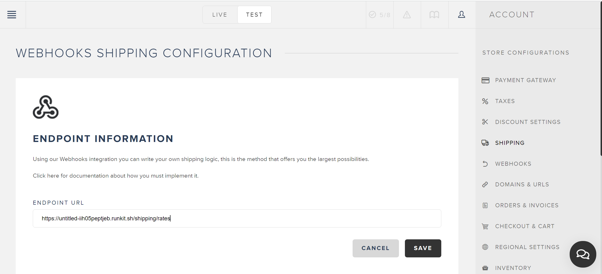
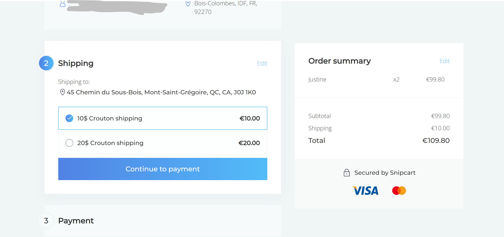
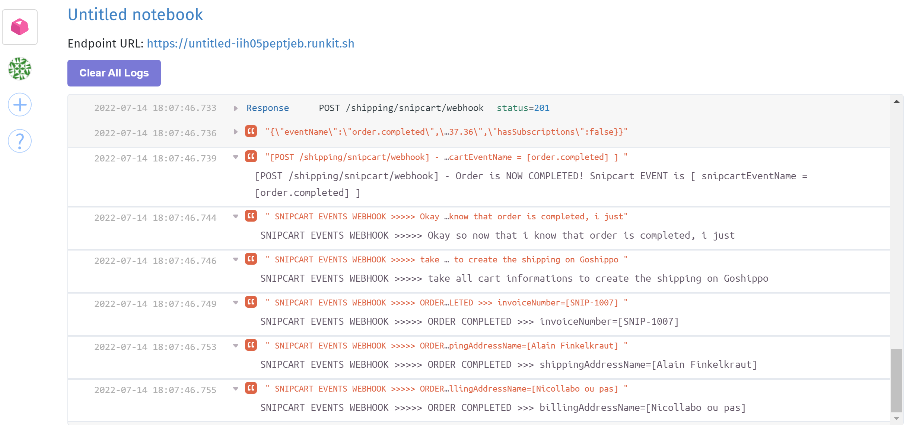

# The Snipcart Shippo Adapter Bot

## Set up the Express JS TypeScript Project

* create the `package.json` : 

```bash 

# create package.json

npm init --yes

# install typescript dev dependencies 
npm i -D typescript @types/express @types/node  @types/cors @types/debug @types/express-winston source-map-support tslint concurrently nodemon


# generate the typescript config

npx tsc --init


# -- runtime dependencies

npm install --save dotenv express express-winston winston debug cors
npm i --save shelljs @types/shelljs
npm i --save ejs @types/ejs

mkdir -p ./src/common/
mkdir -p ./src/users/

touch ./src/index.ts
touch ./src/common/common.routes.config.ts
touch ./src/users/users.routes.config.ts
```


## Tests

* Send the POST Http Request just as if i was Snipcart sending the WebHook Http Post Request with JSON payload, to fetch shipping rates : 


```bash

export POKUS_JSON_PAYLOAD="
{
  \"eventName\": \"shippingrates.fetch\",
  \"mode\": \"Live\",
  \"createdOn\": \"2015-02-21T14:58:02.6738454Z\",
  \"content\": {
    \"token\": \"22808196-0eff-4a6e-b136-3e4d628b3cf5\",
    \"creationDate\": \"2015-02-21T14:58:02.6738454Z\",
    \"modificationDate\": \"2015-02-21T14:58:02.6738454Z\",
    \"status\": \"Processed\",
    \"currency\": \"USD\",
    \"lang\": \"en\",
    \"paymentMethod\": \"CreditCard\",
    \"email\": \"customer@snipcart.com\",
    \"cardHolderName\": \"Nicolas Cage\",
    \"billingAddressName\": \"Nicolas Cage\",
    \"billingAddressCompanyName\": \"Company name\",
    \"billingAddressAddress1\": \"888 The street\",
    \"billingAddressAddress2\": \"\",
    \"billingAddressCity\": \"Québec\",
    \"billingAddressCountry\": \"CA\",
    \"billingAddressProvince\": \"QC\",
    \"billingAddressPostalCode\": \"G1G 1G1\",
    \"billingAddressPhone\": \"(888) 888-8888\",
    \"shippingAddressName\": \"Nicolas Cage\",
    \"shippingAddressCompanyName\": \"Company name\",
    \"shippingAddressAddress1\": \"888 The street\",
    \"shippingAddressAddress2\": \"\",
    \"shippingAddressCity\": \"Québec\",
    \"shippingAddressCountry\": \"CA\",
    \"shippingAddressProvince\": \"QC\",
    \"shippingAddressPostalCode\": \"G1G 1G1\",
    \"shippingAddressPhone\": \"(888) 888-8888\",
    \"shippingAddressSameAsBilling\": true,
    \"finalGrandTotal\": \"310.00\",
    \"shippingAddressComplete\": true,
    \"creditCardLast4Digits\": \"4242\",
    \"shippingFees\": \"10.00\",
    \"shippingMethod\": \"Livraison\",
    \"items\": [{
      \"uniqueId\": \"eb4c9dae-e725-4dad-b7ae-a5e48097c831\",
      \"token\": \"22808196-0eff-4a6e-b136-3e4d628b3cf5\",
      \"id\": \"1\",
      \"name\": \"Movie\",
      \"price\": \"300.00\",
      \"originalPrice\": \"300.00\",
      \"quantity\": \"1\",
      \"url\": \"https://snipcart.com\",
      \"weight\": \"10.00\",
      \"description\": \"Something\",
      \"image\": \"http://placecage.com/50/50\",
      \"customFieldsJson\": \"[]\",
      \"stackable\": true,
      \"maxQuantity\": null,
      \"totalPrice\": \"300.0000\",
      \"totalWeight\": \"10.00\",
      \"shippable\": true
    }],
    \"subtotal\": \"610.0000\",
    \"totalWeight\": \"20.00\",
    \"discounts\": [],
    \"willBePaidLater\": false
  }
}
"

# export ERUPTION_BASE_URL="https://untitled-iih05peptjeb.runkit.sh"
export ERUPTION_BASE_URL="https://eruptionbot.herokuapp.com"
export ERUPTION_BASE_URL="http://127.0.0.1:5656"

echo "ERUPTION_BASE_URL=[${ERUPTION_BASE_URL}]"
echo "${POKUS_JSON_PAYLOAD}" | jq .

curl -iv \
     -X POST "${ERUPTION_BASE_URL}/snipcart/shipping/rates" \
     -H 'Content-Type: application/json' \
     -d "${POKUS_JSON_PAYLOAD}" | tail -n 1 | jq .

```


* HEre is the JSOn Payload sent by the snipcart Webhook, when `order.completed` event occurs : 

```bash 
{"eventName":"customauth:customer_updated","mode":"Test","createdOn":"2022-07-14T15:22:55.9845125Z","content":{"id":"3bd0d38e-3748-4b73-8bc3-162bbdb9e7af","email":"croutontechlead@gmail.com","mode":"Test","statistics":{"ordersCount":0,"ordersAmount":null,"subscriptionsCount":0},"creationDate":"2022-07-13T16:03:21.347Z","billingAddressFirstName":null,"billingAddressName":"CroutonTechLead","billingAddressCompanyName":null,"billingAddressAddress1":"8 Impasse du Martin Pêcheur","billingAddressAddress2":"","billingAddressCity":"Agde","billingAddressCountry":"FR","billingAddressProvince":"Occitanie","billingAddressPostalCode":"34300","billingAddressPhone":"","shippingAddressFirstName":null,"shippingAddressName":"Paul Bismuth","shippingAddressCompanyName":null,"shippingAddressAddress1":"5 Rue Achille Martinet","shippingAddressAddress2":"","shippingAddressCity":"Paris","shippingAddressCountry":"FR","shippingAddressProvince":"IDF","shippingAddressPostalCode":"75018","shippingAddressPhone":"","shippingAddressSameAsBilling":false,"status":"Unconfirmed","sessionToken":"7facc5ba-f0a8-4e92-88ab-47bbc2e86e11","gravatarUrl":"https://www.gravatar.com/avatar/5015e40bf1b74ca2913bb5735cb659ad?s=70&d=https%3a%2f%2fcdn.snipcart.com%2fassets%2fimages%2favatar.jpg","billingAddress":{"fullName":"CroutonTechLead","firstName":null,"name":"CroutonTechLead","company":null,"address1":"8 Impasse du Martin Pêcheur","address2":"","fullAddress":"8 Impasse du Martin Pêcheur","city":"Agde","country":"FR","postalCode":"34300","province":"Occitanie","phone":"","vatNumber":null,"hasMinimalRequiredInfo":true,"validationErrors":{}},"shippingAddress":{"fullName":"Paul Bismuth","firstName":null,"name":"Paul Bismuth","company":null,"address1":"5 Rue Achille Martinet","address2":"","fullAddress":"5 Rue Achille Martinet","city":"Paris","country":"FR","postalCode":"75018","province":"IDF","phone":"","vatNumber":null,"hasMinimalRequiredInfo":true,"validationErrors":{}}}}
```

## Snipcart Dashboard configuration

You go to the Shipping menu, you activate webhook option, and click the "Configure" button for the webhook option, then you give the webhook URL, (must be configured at https://app.snipcart.com/dashboard/carriers/webhooks), here i gave the runkit Endpint URL, which is https://eruption.kerokuapp.com/snipcart/shipping/rates : 





Annnddd, Finally, here is what i get on my website !!! : 



<!-- /C/Users/Utilisateur/crouton/documentation/architecture/goshippo-snipcart-formspree\shippo-snipcart-adapter\first-integration-result-via-runkit.1.PNG -->

And here below the endpoint displays you all order details when `order.completed` snipcart event occurs :





## References

tutorials about setting up a typescript Express JS Project : 

* https://blog.logrocket.com/how-to-set-up-node-typescript-express/
* http://expressjs.com/en/starter/examples.html#additional-examples

About ExpressJS patterns : 

* http://expressjs.com/en/guide/routing.html (especially the `Router()` )
* https://www.toptal.com/express-js/nodejs-typescript-rest-api-pt-1
* https://kimsereylam.com/typescript/2021/12/03/winston-logger-with-typescript.html